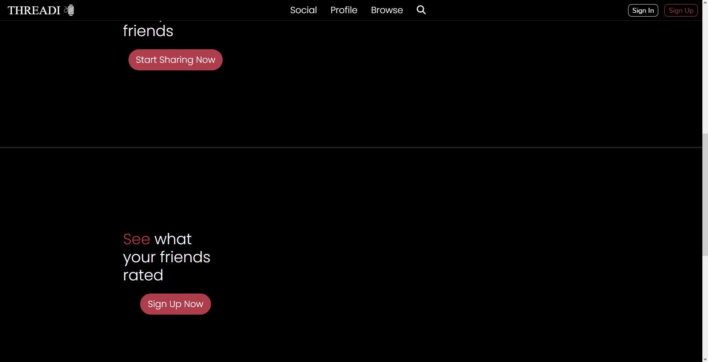
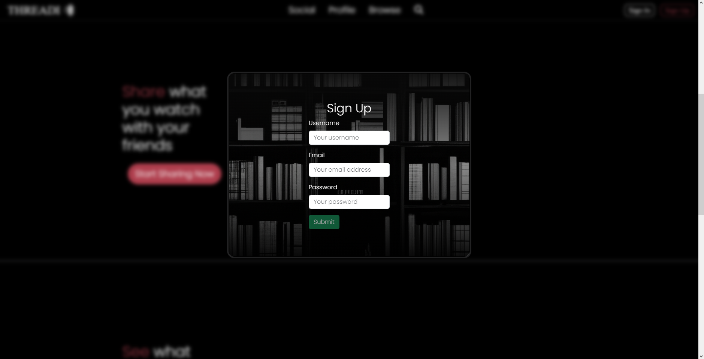
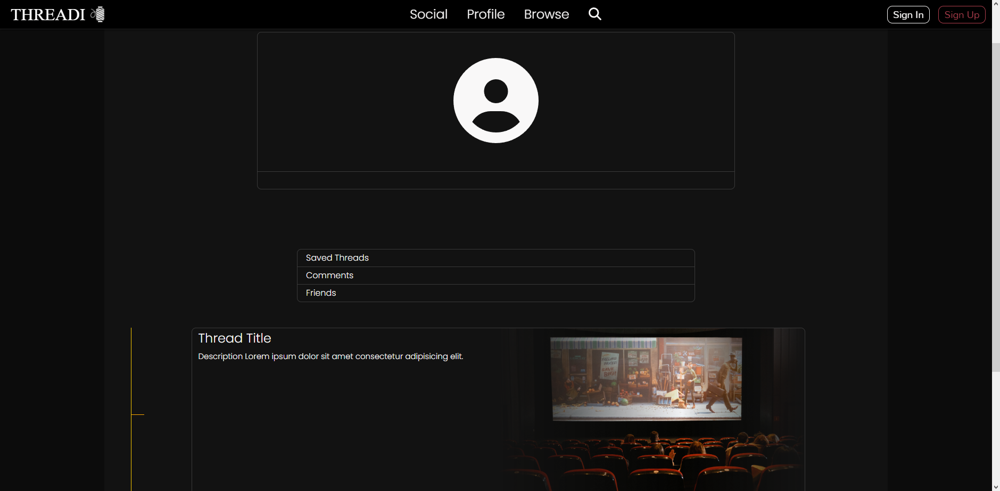
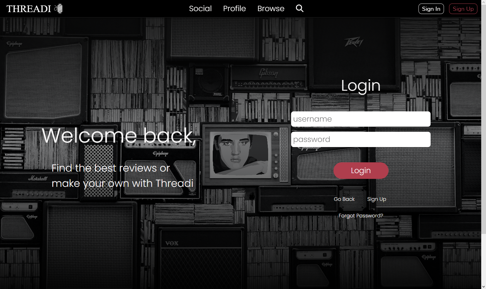

# 

## Deployed Application

## Description

Threadi is a website for all things media! The #1 spot for saving and sharing movies. This app allows you to find and share movies with friends anywhere, as well as rate and comment on any movies. add friends and see what they have to say about the hotest movies! sign up now!

## Table of Contents

- [Installation](#installation)
- [Usage](#usage)
- [Questions](#Questions)
- [License](#license)

## Installation

click on the link to view the website. if you would like to view or use the code, you can clone to a local file.

## Usage

Find, comment, and share movie experiences with friends
## screenshots

</a>
 

</a>
 

</a>
 

</a>
 

## License

This project uses the MIT licence

---

🏆

## Contributors
* James Schoeder

* Kolt Bodzo

* Roy Hargrave

* Xavier Whiterspoon
## Questions

* github: https://github.com/Jamesgit22
* Email: jamesschroedermail97@gmail.com

